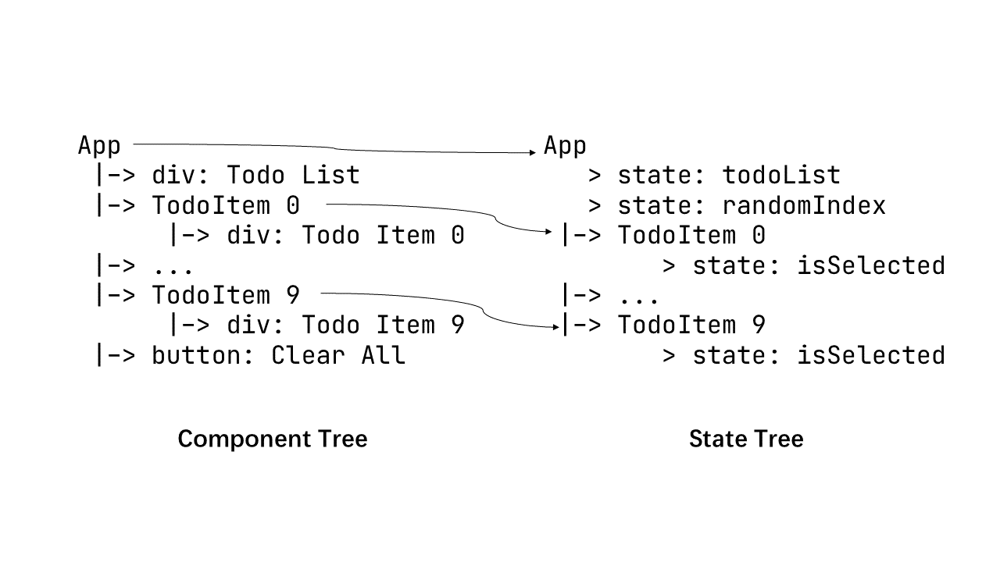

# 300-Lines-React-Hooks-In-Rust
A minimal implementation of react hooks in Rust.

# 300 行 Rust 代码实现 React Hooks

最近在用 Rust 写一个 Native GUI 框架的玩具，调研了一圈状态管理模式后，觉得 React Hooks 的设计蛮不错，在 Github 搜了一圈，想找找可以参考的实现，发现 Web 框架 [Yew](https://yew.rs/) 的实现还可以，此外 Rust Native GUI 框架中有个叫 [Dioxus](https://github.com/DioxusLabs/dioxus) 也是用的 React 这套范式，不过，看完它们代码后，总感觉有点怪怪的，比如 Dioxus 在实现组件的时候，官方的 Example：

```Rust
fn app(cx: Scope) -> Element {
    let mut count = use_state(&cx, || 0);

    cx.render(rsx! {
        h1 { "High-Five counter: {count}" }
        button { onclick: move |_| count += 1, "Up high!" }
        button { onclick: move |_| count -= 1, "Down low!" }
    })
}
```

有两个槽点：
1. 需要把一个 `cx` 传来传去；
2. 组件的结构用 `rsx!` 宏来定义。

再来看看 Yew 的示例：

```Rust
use yew::{Callback, function_component, html, use_state};

#[function_component(StateComp)]
fn state_comp() -> Html {
    let counter = use_state(|| 0);
    let onclick = {
        let counter = counter.clone();
        Callback::from(move |_| counter.set(*counter + 1))
    };


    html! {
        <div>
            <button {onclick}>{ "Increment value" }</button>
            <p>
                <b>{ "Current value: " }</b>
                { *counter }
            </p>
        </div>
    }
}
```

很好，没有”多余“的 `cx` 变量了，转而用宏来声明组件，不过新的槽点出现了：我定义的函数式组件明明有个函数名了，为啥还要给宏传入参数来作为组件名呢？而且组件结构依然是用 `html!` 宏来声明。

不过问题不大，先抛开定义组件的范式不谈，其实很多 Rust 的 GUI 框架都对 html / jsx 的那套写法念念不忘，而搞出来 `rsx!` / `jsx!` 这些过程宏来模拟 html / jsx 的写法，虽然形似了，但写起来却无比难受，因为这些玩意儿不是 Rust 原生语法，写所谓的 `rsx!` / `jsx!` 代码是没有任何补全可言的，而且 Rust 宏的调试也比较困难。

然后说说组件的定义范式，Dioxus 的组件是一个真正的函数，而 Yew 的组件是个长得像函数的结构体，上面的例子中，`function_component!` 宏会把 `state_comp()` 转换成 `StateComp` 结构体，然后 `html!` 宏将 html 代码转换成一堆和 `StateComp` 类似的结构体嵌套成的树状结构来描述 UI，所以 Yew 才需要手动设置转换后的结构体名称。

转换后的代码如下所示：

```Rust

#[allow(unused_parens)]
struct StateComp {
    _marker: ::std::marker::PhantomData<()>,
    function_component: ::yew::functional::FunctionComponent<Self>,
}
impl ::yew::functional::FunctionProvider for StateComp {
    type Properties = ();

    fn run(
        ctx: &mut ::yew::functional::HookContext,
        props: &Self::Properties,
    ) -> ::yew::html::HtmlResult {
        fn state_comp(_ctx: &mut ::yew::functional::HookContext, _: &()) -> Html {
          // 省略一些代码
          #[allow(clippy::useless_conversion)]
              <::yew::virtual_dom::VNode as ::std::convert::From<_>>::from({
                  #[allow(clippy::redundant_clone, unused_braces)]
                  let node = ::std::convert::Into::<::yew::virtual_dom::VNode>::into(
                      ::yew::virtual_dom::VTag::__new_other(
                          ::std::borrow::Cow::<'static, ::std::primitive::str>::Borrowed("div"),
                          ::yew::virtual_dom::VList::with_children(
// 省略剩下的代码
```

其实从开发体验的角度来看，写两遍名字多少有点脱裤子放屁了，其实完全可以用宏将函数名直接转换为对应的驼峰式结构体命名嘛。

而且从展开后的代码可以看到，那个熟悉的 `ctx` 它又来了，它的类型 `HookContext` 也表明它和本文要讲的 hook 有关。

## 函数式组件的上下文
函数式编程是一个很唬人的名词，React 刚引入函数式组件时，很多程序员趋之若鹜，但很多像我一样的初学者看到函数式组件时，总会发出灵魂之问：[这哪里函数式了？](
https://www.zhihu.com/question/343314784/answer/937174224)

React 核心开发者 Dan 很早就写过[一篇文章](https://overreacted.io/zh-hans/how-are-function-components-different-from-classes/)来阐述函数式组件与类组件的关系，里面有一句很有意思的话：函数式组件捕获了渲染所用的值。有意思的点就在于“捕获”二字，如果你背诵过 Javascipt 的八股文，就知道 Javascipt 的闭包往往和局部变量一起使用，一个典型的使用场景如下所示：

```js
const debounce = (delay, cb = () => {}) => {
    let timer = null

    return (...args) => {
        if (timer) clearTimeout(timer)
        timer = setTimeout(() => cb(...args), delay);
    }
}

const f = debounce(1000, console.log)

f(1)
setTimeout(() => f(2), 500) // 500ms 后调用 f(2) 

// 1000ms 后只会打印 2，而 1 不会被打印
```

`debounce` 函数返回了一个闭包函数，而这个闭包则捕获了局部变量 `timer`，并在每次执行的时候检查是否应该清除上次调用的延时函数。

这看起来很美好，然而如果我们将这种可变捕获应用到更复杂的例子里，事情就变得复杂起来了，比如下面这种情况：

```js
const foo = () => {
    const complexObj = {
        val: 1
    }

    const printValOfObj = () => {
        console.log(complexObj.val)
    }

    setTimeout(() => {
        printValOfObj()
    }, 100);

    complexObj.val = 114514
}

foo()

// >> 114514 会被打印，而不是 1
```

Javascipt 的闭包在捕获非原始类型（Object / Array 等）时，总是持有它们的引用，而且由于 Javascipt 宽松的可变性控制，即使你将被捕获的值声明为 `const`，别人也可以轻松绕过这道马奇诺防线修改它的内部值，这也前端老八股了。

正是这种形同虚设的可变性控制，使用 React 类组件构建复杂应用时就非常出问题，因为放在 `this` 中的值太不靠谱了，但是基于不可变状态的 React Hooks 以及函数式组件却没有这种烦恼。

比如一个典型的 React 函数式组件：

```jsx
function simpleComp() {
    const [count, setCount] = useState(0) 

    return <button onClick={() => setCount(count + 1)}>click me {count}</button>
}

```

这跟我们前文展示的 Yew 和 Dioxus 的示例如出一辙（这句是纯纯废话，哪有爹像儿子的），同时也隐藏了初学者们最大的疑惑：你这函数看起来不纯啊，这不还是有内部状态嘛？

哈哈，确实。React 会在 diff 的时候帮你把组件的状态保持下来，从而使函数式组件拥有了状态，但这种状态同样可以看作是外部注入的，还记得我们在前文吐槽的 `ctx` 和 `cx` 吗？它们其实就是外部注入给组件的状态，而 React 在运行时也同样会帮你做这件事，你的组件在运行时更像这个样子：

```js
funtion simpleComp(ctx) {
    const [count, setCount] = useState(ctx, 0)

    return <button onClick={() => setCount(count + 1)}>click me {count}</button>
}
```

而此时，这个函数式组件是不是变得“纯”了起来？这里的 `ctx`，我们可以称之为函数式组件的上下文（Hook Context，注意和组件的 useContext hook 做区分，但到了后面你就知道它们关系也很紧密），而 `useState` 这些 hook 做的事情就是从上下文中取出外部注入给组件的状态的深拷贝： `const [state, setState] = useState(initialState)`，即便我们不小心改变了 `state` 的值，也不会影响组件真正的状态，而如果想要改变 `state`，则只能通过 `setState` 去更新，从而让组件状态拥有了严格的可变性控制。

## 声明式组件的状态
在 jQuery 时代，人们总是习惯使用 `$(dom).text(name)` 的方式更新页面 UI，这种一般称为命令式编程，后来大家觉得这样好麻烦，就出现了 React 这样的声明式框架来糊页面。

声明式的好处在于可以很方便地做组件抽象，页面结构以一种合乎直觉的方式描绘出来，在 React 中，一个典型的组件结构可以这样描绘出来：

```jsx
function App() {
    const [todoList, setTodoList] = useState(new Array(10).fill(0))
    const [randomIndex, setRandomIndex] = useState(Math.ceil(Math.random() * todoList.length))

    return <div>
        <div>Todo List</div> 
        {
            todoList.map((_, i) => <TodoItem key={i} text={`item ${i}`} disabled={i === randomIndex}/>)
        }
        <button onClick={() => setTodoList([])}>Clear All</button>
    </div>
}

function TodoItem(props = { disabled: false, text: '' }) {
    const [isSelected, setSelected] = useState(false)

    return <div onClick={() => !props.disabled && setSelected(true)}>
        Todo Item {props.text} { selectedIndex === i ? 'Selected' : ''}
    </div>
}
```

我们可以用书写逻辑代码的方式描述组件的动态交互状态，上面的例子中，我们把每个 TodoItem 组件的选中状态封装起来，而 Todo 内容和禁用状态为受控状态。

整个 App 的状态通过 `useState` 被**声明**了出来，当状态改变时，UI 也会随之改变，此时页面的组件结构和对应的状态如下图：

